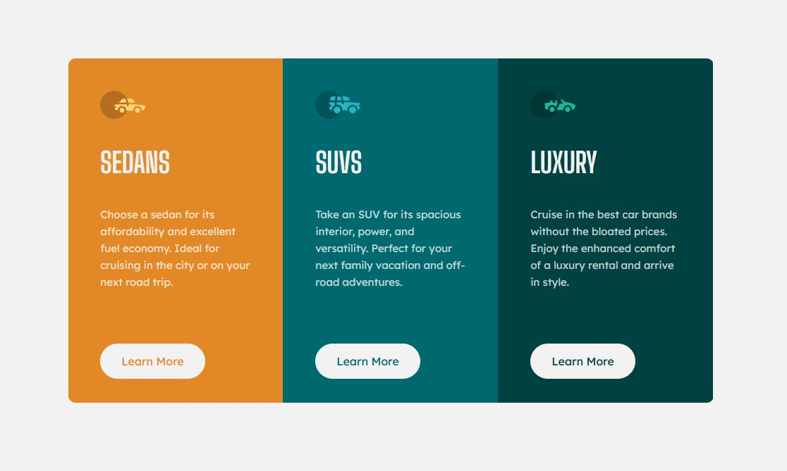

# Frontend Mentor - 3-column preview card component solution

This is a solution to the [3-column preview card component challenge on Frontend Mentor](https://www.frontendmentor.io/challenges/3column-preview-card-component-pH92eAR2-). Frontend Mentor challenges help you improve your coding skills by building realistic projects. 

## Overview
Responsive 3-column preview card component.
### The challenge
Build 3-column preview card component that is responsive at sizes 375px & 1440px.

### Screenshot

### Links

- Solution URL: (https://palmettophoto/3-column-preview-card.git)
- Live Site URL: (https://palmettophoto.github.io/3-column-preview-card/)

## My process
HTML & CSS without framework. 
### Built with

- Semantic HTML5 markup
- CSS custom properties
- Flexbox
- CSS Grid

### What I learned

Further trying to work on simplifying my code. I worked on eleminating unecessary nesting and improving my class naming.

### Continued development

Deeper dive into streamlining and simplifying html & css. Need to focus on getting a working knowledge of grid, and digging deeper into Javascript.

## Author

- Website - (https://rockhillvideomarketing.com)
- Frontend Mentor - (https://www.frontendmentor.io/profile/Taddo)

